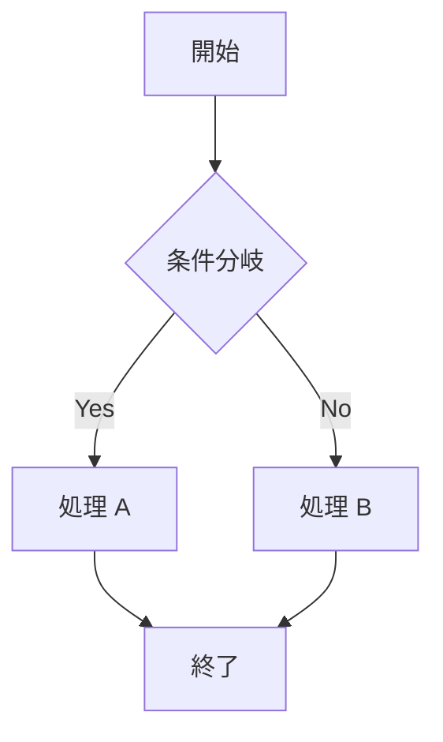

# Mermaid to Image Converter

Mermaid 記法のコードをリアルタイムでプレビューし、**SVG** または **PNG** としてダウンロードできる Web アプリです。

## 機能

- Mermaid コードのリアルタイムプレビュー
- SVG ダウンロード（日本語フォント対応）
- PNG ダウンロード（2倍解像度）
- シンタックスエラーの即時表示
- XSS・インジェクション対策済み（公開環境対応）

## 技術スタック

| 技術 | 用途 |
|------|------|
| [React 19](https://react.dev/) | UI フレームワーク |
| [Mermaid.js](https://mermaid.js.org/) | 図のレンダリング |
| [Tailwind CSS v4](https://tailwindcss.com/) | スタイリング |
| [Vite](https://vite.dev/) | ビルドツール |
| [TypeScript](https://www.typescriptlang.org/) | 型安全 |

## セットアップ

### 必要な環境

- Node.js v18 以上
- npm v9 以上

### インストール

```bash
# リポジトリをクローン
git clone <repository-url>
cd mermaid-to-image-converter

# 依存関係をインストール
npm install
```

## 実行コマンド

### 開発サーバーの起動

```bash
npm run dev
```

ブラウザで `http://localhost:5173` を開いてください。

### プロダクションビルド

```bash
npm run build
```

ビルド成果物は `dist/` ディレクトリに生成されます。

### ビルド結果のプレビュー

```bash
npm run preview
```

ブラウザで `http://localhost:4173` を開いてください。

### 型チェック

```bash
npm run lint
```

### GitHub Pages へのデプロイ

このプロジェクトは GitHub Actions を使用して自動デプロイするように設定されています。

1. GitHub リポジトリの **Settings > Pages** を開く
2. **Build and deployment > Source** で `GitHub Actions` を選択
3. `main` ブランチにプッシュすると、自動的にビルドとデプロイが行われます。

手動でビルドして `dist` フォルダをアップロードする場合も、`vite.config.ts` の `base: './'` 設定により正常に動作します。

1. 左側のエディタに Mermaid のコードを入力する
2. 右側にリアルタイムでプレビューが表示される
3. ヘッダー右上のボタンでダウンロード
   - **SVG** ボタン: ベクター形式でダウンロード（PowerPoint などに貼り付け可）
   - **PNG** ボタン: ラスター形式でダウンロード（2倍解像度）

## Mermaid コード例



詳しい構文は [Mermaid 公式ドキュメント](https://mermaid.js.org/intro/) を参照してください。

## ディレクトリ構成

```
mermaid-to-image-converter/
├── src/
│   ├── components/
│   │   └── MermaidRenderer.tsx  # Mermaid レンダリングコンポーネント
│   ├── App.tsx                  # メインアプリケーション
│   ├── main.tsx                 # エントリーポイント
│   └── index.css                # グローバルスタイル
├── index.html
├── package.json
├── tsconfig.json
└── vite.config.ts
```
